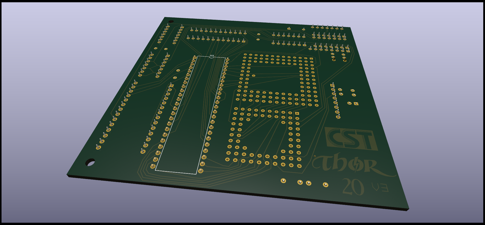
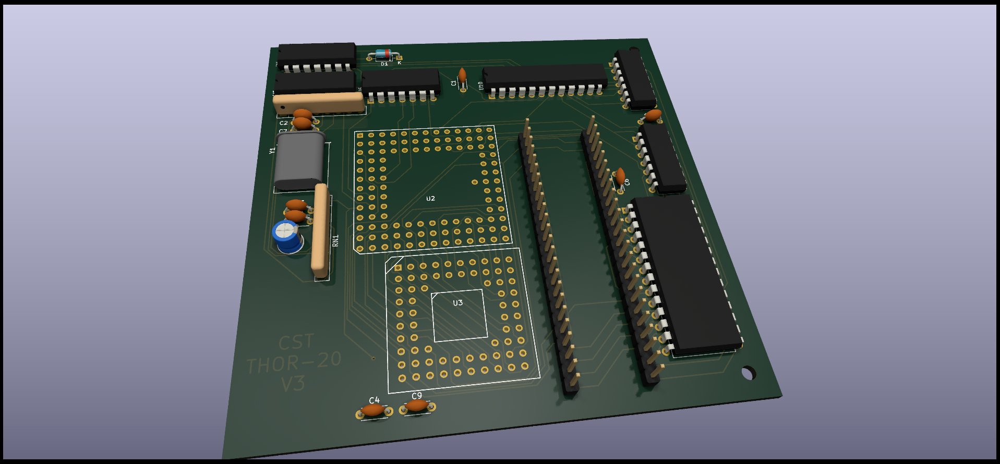

# QPLANE - SINCLAIR QL Backplane port expansion.

(C) 2023 Alvaro Alea Fernandez

License under: CERN Open Hardware Licence Version 2 - Strongly Reciprocal

https://ohwr.org/cern_ohl_s_v2.txt

This board is the "overdrive" board that shall upgrade the 68008 processor of the Sinclair QL to a 68020 one.

THIS BOARD HAS NOT BEEN TESTED!! Use at your own risk.

##Information

There at least 1 GAL and 1 ROM with ecuations or contens are missing so it not usable at present.

* Get energy from diferent a power supply.
* Dimensions are not checked, there is mismatch in pictures.
* Schematic is not pretty, but is enought to be able to do the PCB.

