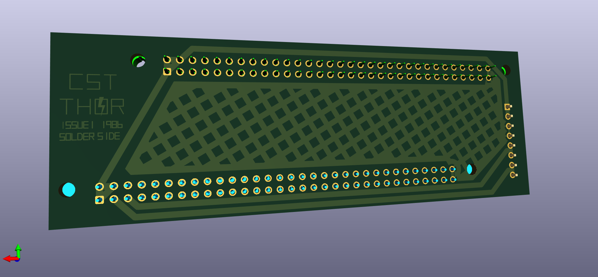
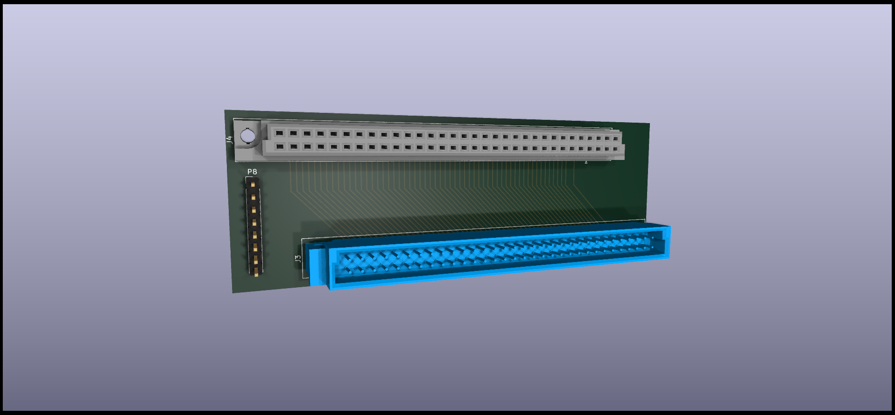

# QPLANE - SINCLAIR QL Backplane port expansion.

(C) 2023 Alvaro Alea Fernandez

License under: CERN Open Hardware Licence Version 2 - Strongly Reciprocal

https://ohwr.org/cern_ohl_s_v2.txt

This board has been reverse engineered from pictures freely available on internet.

THIS BOARD HAS NOT BEEN TESTED!! Use at your own risk.

##Information

This backplane is a replacement of the original that come with Thor PC Computer,
intended for install the QL main board in a case along with the CST expansion board of the Thor Computer.

* Get energy from diferent a power supply.
* Dimensions are not checked, there is mismatch in pictures.
* Schematic is not pretty, but is enought to be able to do the PCB.

