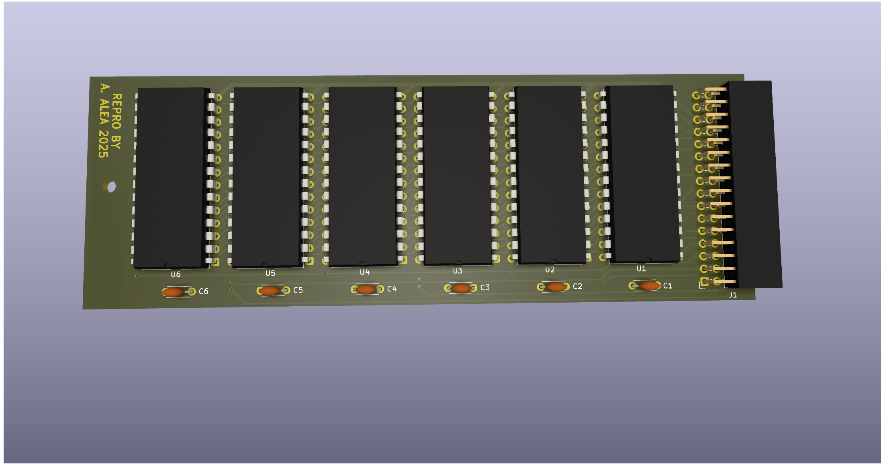

# CST Thor - ROM Board.

(C) 2023 Alvaro Alea Fernandez

License under: CERN Open Hardware Licence Version 2 - Strongly Reciprocal

https://ohwr.org/cern_ohl_s_v2.txt

This board has been reverse engineered from pictures freely available on internet.

THIS BOARD HAS NOT BEEN TESTED!! Use at your own risk.

This is a fast hack, not real dimension or position or tracks.

## Technical Details

The board has space for 6 IC Eprom Memories.
The schematic depend on 2 lines of selection, one is A15 or /A15, and the other come from IC5  and decode the A16,A17 lines, that mean that is targeted for the 6 32Kb IC, (type 27C256) and will use the 0xB0000 to 0xF8FFF leaving the 0xA0000 to 0xAFFFF empty to be used by the expansion slot on the back of the computer. in any case 0xF9000 to 0xFFFFF (last 24kb of memory) is reserved for I/O

Complete decode of the memory space depend of pin 13 of IC4 (BLK0) a programable GAL, so it's unknow, but not expected to have any spacial mapping or shadowing.

From factory, Thor come with 2 socket used and 4 free:

The Thor system rom consist on 40Kb divided in two IC:
- IC6 a 27C64, 8Kb, some pictures has a sticker "Thor" and a date
- IC5 a 27C256, 32Kb, some pictures has a stickers with a version number, Thor20Sysrom (from 4.11 to 5.22 can be found on Dilwin pages)

IC 1-4 are free for other used, and are interchangables:
- IC4 a 27C256, 32Kb, it has sticker with "Speed Screen (C) 1988 CST" (4.23 can be found in thor820roms.zip on Dilwin pages)
- IC3 a 27C256, 32Kb, it has sticker with "Int ROM 0952" InterLogic Extension package (2.10 cann be found in thor820roms.zip on Dilwin pages)
- IC2,IC1 type 27C256, 32Kb, its show in some pictures unpopulated, and in others with a "1","2", o "3" (for IC3) stickers, it's not clear the contents, but is expected that can be ROM for compiler or other kind of toolkit for the QL

Usually ROM Toolkit for QL area 16Kb, it's not clear if Thor ROM inicializate all posible 16Kb blocks, or requiered a user inicialization, or if there is a diferent mechanism to inicializate it.
