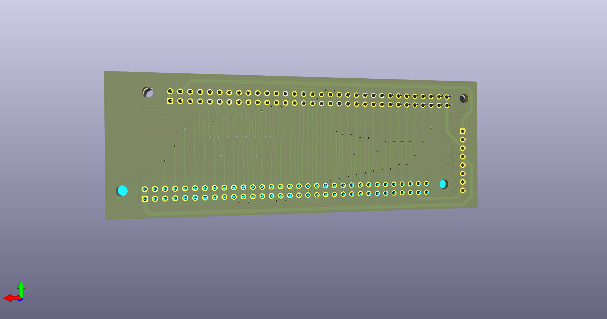
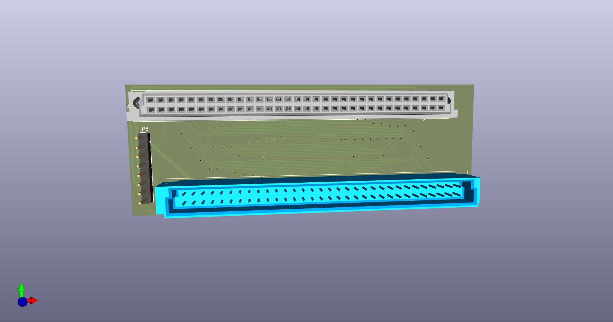

# QPLANE - SINCLAIR QL Backplane port expansion.

(C) 2023 Alvaro Alea Fernandez

License under: CERN Open Hardware Licence Version 2 - Strongly Reciprocal

https://ohwr.org/cern_ohl_s_v2.txt

This board is a FANTASY board that shall allow to install a QL board with standar interfaces in a Thor case.

THIS BOARD HAS NOT BEEN TESTED!! Use at your own risk.

##Information

intended for install the QL main board in a case along with memory, trump card, CST Disk or other expansion boards of the Sinclair QL Computer.

* Get energy from diferent a power supply.
* Dimensions are not checked, there is mismatch in pictures.
* Schematic is not pretty, but is enought to be able to do the PCB.

